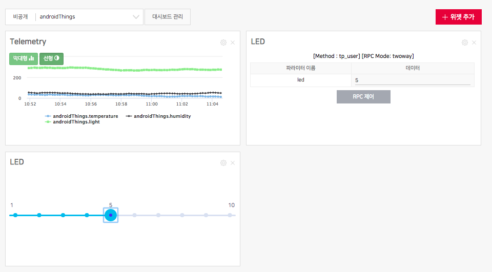

ThingPlug Simple SDK Sample for Android Things
===

## Overview
ThingPlug Simple SDK for Android를 Android Things에 응용한 예제 프로젝트 입니다.
* **[ThingPlug Simple SDK for Android](https://github.com/SKT-ThingPlug2/device-sdk-android)**


## Requirements
* **[AndroidStudio 3.x](https://developer.android.com/studio/index.html)**
* **[API Level](https://developer.android.com/guide/topics/manifest/uses-sdk-element.html)**

```
defaultConfig {
	minSdkVersion 24
	targetSdkVersion 26
}
```

### Library
Android Simple SDK를 사용하기 위해서 MQTT client가 필요합니다.
Android Simple SDK에서는 오픈소스 프로젝트인 paho를 사용하고 있습니다. paho 프로젝트에 대해서는 아래 링크를 참고하시기 바랍니다.

라이브러리 | 기능 | 홈페이지
------------ | ------------- | -------------
__paho__ | MQTT | **[paho Homepage](https://eclipse.org/paho/)**


## Getting Started
Android Simple SDK는 소스코드 형태로 제공되며 Application에서의 사용을 위해서는 다음과 같이 import하여 사용하면 됩니다.
보다 자세한 사용 예시는 소스코드를 참고하시기 바랍니다.

### Project에 Simple SDK 연결
신규 Project에 Simple SDK를 추가하고자 할 경우, 아래와 같이 추가하시기 바랍니다. 여기서 제공되는 Sample App 프로젝트들에는 이미 SDK가 포함되어 있습니다.

1. Project에 Simple 모듈 추가
	- `Menu > File > Project Structure` 선택
	<br/>
	- 좌상단의 '+' 버튼 클릭
	<br/>
	- `Import .JAR/.AAR Package` 선택
	<br/>
	- `simple_sdk-release.aar` 파일 선택 후 `Finish` 
	<br/>
2. SDK 를 사용할 모듈에 Simple SDK 모듈 연결
	- `build.gradle(Module: app)` 선택
	<br/>
	- `dependencies` 에 아래 내용을 추가
	
	```
	// Simple SDK
    compile project(':simple_sdk-release')
    // mqtt
    compile 'org.eclipse.paho:org.eclipse.paho.client.mqttv3:1.1.0'
    compile('org.eclipse.paho:org.eclipse.paho.android.service:1.1.1') {
        exclude module: 'support-v4'
    }
    // json
    compile 'com.google.code.gson:gson:2.7'
    // annotation
    compile 'com.android.support:support-annotations:27.1.0'
	```	

### Simple SDK import

    import tp.skt.simple.api.Simple;
    import tp.skt.simple.common.Define.DATA_FORMAT;
    import tp.skt.simple.element.ArrayElement;
    import tp.skt.simple.element.RPCResponse;
    import tp.skt.simple.net.mqtt.SimpleCallback;
    import tp.skt.simple.net.mqtt.SimpleConfiguration;
    import tp.skt.simple.net.mqtt.SimpleListener;


## Simple API 생성
Simple API 를 사용하기 위해서는 Simple 객체를 생성해야 합니다.

```java
Simple simple = new Simple(
	Context context, 
	String serviceId, 
	String deviceId, 
	String userName, 
	SimpleConfiguration simpleConfiguration, 
	SimpleListener simpleListener, 
	boolean logEnabled);
```
파라미터 | 설명
------------ | -------------
__context__ | 앱 context
__serviceId__ | ThingPlug 서비스 ID
__deviceId__ | ThingPlug 디바이스 ID
__userName__ | ThingPlug 계정 ID
__simpleConfigration__ | MQTT 연결을 위한 값들 세팅
__simpleListener__ | 각종 이벤트 Listener
__logEnabled__ | 디버깅을 위한 로그 Enable or Disable

### SimpleConfiguration 생성
Simple 객체 생성을 위해서 SimpleConfiguration 객체 생성해야 합니다.

```java
Simple simple = new SimpleConfiguration(
	String mqttServerAddress, 
	String clientID, 
	String loginName, 
	String loginPassword);
```

파라미터 | 설명 |  예시
------------ | ------------- | -------------
__mqttServerAddress__ | ThingPlug Server 주소 | TLS사용 : `ssl://test.sktiot.com`, 미사용 : `tcp://test.sktiot.com`
__clientID__ | ThingPlug 연결을 위한 MQTT Client-ID | 디바이스 토큰 : `78a3b1a....`
__loginName__ | ThingPlug 연결을 위한 MQTT ID | 디바이스 토큰 : `78a3b1a....`
__loginPassword__ | ThingPlug 연결을 위한 MQTT Password | `null`


mqttServerAddress 값의 경우 TLS 사용을 위해서는 MQTT broker 주소앞에 `ssl://` 을 포함하면 됩니다. 포트번호가 `8883`인 경우 생략 가능합니다.

TLS 사용 시, ThingPlug의 MQTT broker 주소는 다음과 같습니다.
```
ssl://test.sktiot.com
```
TLS를 사용하지 않을 경우, MQTT broker 주소앞에 `tcp://` 를 포함하면 됩니다. 포트번호가 `1883`인 경우 생략 가능합니다.

TLS 미사용 시, ThingPlug의 MQTT broker 주소는 다음과 같습니다.
```
tcp://test.sktiot.com
```


### SimpleListener 사용
MQTT 서버에 연결 후, 각종 이벤트 처리를 위하여 SimpleListener를 등록해야 합니다.

```java
SimpleListener simpleListener = new SimpleListener() {
        @Override
        public void onPush(String message) {
            Log.e(TAG, "push message : " + message);
        }

        @Override
        public void onDisconnected() {
            Log.e(TAG, "disconnect success!");
        }

        @Override
        public void onDisconnectFailure() {
            Log.e(TAG, "disconnect failure!");
        }

        @Override
        public void onSubscribed() {
            Log.e(TAG, "subscribe success!");
        }

        @Override
        public void onSubscribeFailure() {
            Log.e(TAG, "subscribe failure!");
        }

        @Override
        public void onConnected() {
            Log.e(TAG, "connect success!");
        }

        @Override
        public void onConnectFailure() {
            Log.e(TAG, "connect fail!");
        }

        @Override
        public void onConnectionLost() {
            Log.e(TAG, "connection lost!");
        }

        @Override
        public void onDelivered() {
            Log.e(TAG, "message delivered!");
        }
    }
);
```

### Simple API 
SKT ThingPlug 서버와 Simple 통신을 위한 API 는 `tp.skt.simple.api.Simple.java` 파일에 정의되어 있습니다.

주요 함수 | 설명
------------ | -------------
__tpSimpleInitialize__ | ThingPlug 서비스이름, 디바이스 이름, 계정 ID를 설정한다.
__tpSimpleConnect__ | 서버에 연결한다.
__tpSimpleDisconnect__ | 서버 연결을 끊는다.
__tpSimpleDestroy__ | MQTT 연결 및 리소스들을 해제한다.
__tpSimpleIsConnected__ | MQTT 연결상태를 확인한다.
__tpSimpleTelemetry__ | 센서정보를 전달한다.
__tpSimpleRawTelemetry__ | 센서정보를 전달한다.(RAW data)
__tpSimpleAttribute__ | 속성정보를 전달한다.
__tpSimpleRawAttribute__ | 속성정보를 전달한다.(RAW data)
__tpSimpleResult__ | 제어결과를 전달한다.
__tpSimpleRawResult__ | 제어결과를 전달한다.(RAW data)
__tpSimpleSubscribe__ | 디바이스정보를 모니터링 한다.
> 각 함수별 파라미터 설명은 `tp.skt.simple.api.Simple.java`에서 확인


Sample Device App 실행
---
1. 실행 로그 
---
[AndroidThings.log](./log/AndroidThings.log)
---
2. Thingplug SensorData
---



Copyright (c) 2018 SK telecom Co., Ltd. All Rights Reserved.
Distributed under Apache License Version 2.0. See LICENSE for details.
